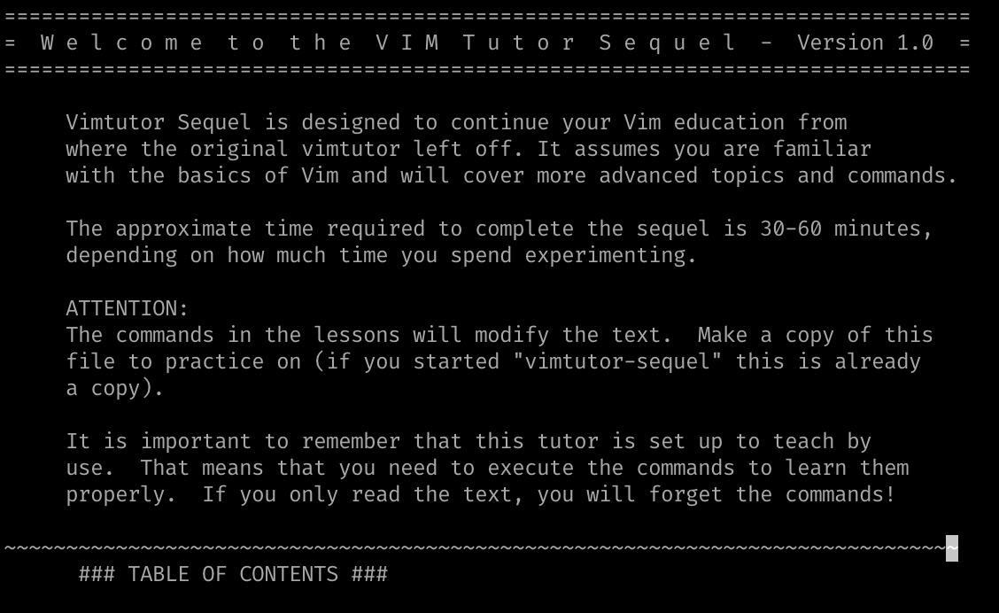

# vimtutor-sequel

Vimtutor Sequel provides advanced Vim tutor lessons to help users deepen their understanding of Vim.



## Features

- Advanced Vim commands and techniques
- Step-by-step tutorials
- Interactive exercises

## Installation

The easiest way to use `vimtutor-sequel` is to install it using Homebrew. However, you can also run the tutorial manually by cloning the repository (see [Running Vimtutor Without Homebrew](#running-vimtutor-without-homebrew)).

If you don't have Homebrew installed, you can install it using the following command:

```sh
/bin/bash -c "$(curl -fsSL https://raw.githubusercontent.com/Homebrew/install/HEAD/install.sh)"
```

### For New Users

To install `vimtutor-sequel` for the first time using Homebrew:

1. **Tap the repository**:

   ```sh
   brew tap micahkepe/vimtutor-sequel
   ```

2. **Install `vimtutor-sequel`**:
   ```sh
   brew install vimtutor-sequel
   ```

### For Existing Users

If you have already installed `vimtutor-sequel` and want to upgrade to the latest version:

1. **Update Homebrew**:

   ```sh
   brew update
   ```

2. **Upgrade `vimtutor-sequel`**:
   ```sh
   brew upgrade vimtutor-sequel
   ```

## Usage

To run the `vimtutor-sequel` script, simply type:

```sh
vimtutor-sequel
```

## Running Vimtutor Without Homebrew

If you are on Windows or Linux, you can still run the tutorial by cloning the repository and running the script manually:

1. **Clone the repository**:

```sh
git clone https://github.com/micahkepe/vimtutor-sequel.git
```

2. **Navigate to the repository**:

```sh
cd vimtutor-sequel
```

3. **Make a Copy of the Tutorial**:

```sh
cp vimtutor-sequel.txt vimtutor-sequel-copy.txt
```

4. **Run Vim with the Custom Configuration**:

```sh
vim -u vimtutor-sequel.vimrc vimtutor-sequel-copy.txt
```

This method allows you to easily access and run the Vimtutor Sequel lessons without the need for additional installation steps.

## License

This project is licensed under the MIT License - see the [LICENSE](LICENSE) file for details.

## Contributing

See [CONTRIBUTING.md](CONTRIBUTING.md) for information on how to contribute to `vimtutor-sequel`.
